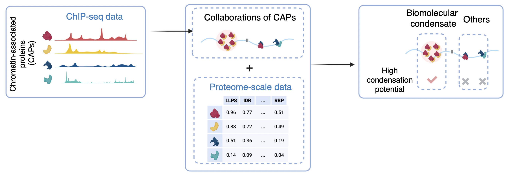

# CondSigDetector

[](https://www.gnu.org/licenses/gpl-3.0)
[](https://www.gnu.org/licenses/gpl-3.0)

**CondSig** (**Cond**ensate-like chromatin-associated proteins co-occupancy **Sig**nature) Detector is a comprehensive computational framework designed to concurrently predict the component CAPs (chromatin-associated proteins) and genomic loci of potential chromatin-associated biomolecular condensates. The computational framework first detects genome-wide CAP collaborations in specific loci by integrating ChIP-seq datasets, and then filters out those potentially involved in biomolecular condensation based on known condensation-related characteristics. 

<p align="center">

</p>

User can also checkout all identified CondSigs in mESC and K562 in our database [CondSigDB](https://compbio-zhanglab.org/CondSigDB/index.html).


## Change Log
### v1.3.0
* Speed up FilterSig module.

### v1.2.3
* Add the summary section in FilterSig module.

### v1.2.2
* Define a new overlap threshold for redudant CondSigs.

### v1.2.1
* Fix bugs about the definition of topic-positive sites and negative-control sites.
* Modify the definition of valid topics.

### v1.2.0
* Add FilterSig module.

### v1.1.0
* Release CondSigDetector.

## System requirements
* Linux/Unix

## Install CondSigDetector

### Installing the CondSigDetector workflow through conda

CondSigDetector uses the [Miniconda3](http://conda.pydata.org/miniconda.html) package management system to harmonize all of the software packages. Users can install the full solution of CondSigDetector using the conda environment, which may take several minutes.

Use the following commands to install Minicoda3：
``` bash
$ wget https://repo.anaconda.com/miniconda/Miniconda3-latest-Linux-x86_64.sh
$ bash Miniconda3-latest-Linux-x86_64.sh
```
And then users can create an isolated environment for CondSigDetector with environment file [environment.yml](https://raw.githubusercontent.com/zhaoweiyu-github/CondSig/main/environment.yml) and install through the following commands:
``` bash
# Create environment for CondSigDetector
$ conda env create -f environment.yml
# Activate the environment
$ conda activate condsig_env
# Install CondSigDetector
$ conda install https://anaconda.org/yuzhaowei/condsig_detector/1.3.0/download/linux-64/condsig_detector-1.3.0-py37_0.tar.bz2
```

### Test CondSigDetector

```bash
# Test CondSigDetector command
condsig_detector LearnSig --help
condsig_detector FilterSig --help
```

## Usage

### LearnSig module

The LearnSig module detects co-occupancy signatures, which depict genome-wide specific collaborations of CAPs. It achieves this by integrating multiple ChIP-seq datasets from the same cell type.

User can checkout documentations and tutorials in [LearnSig](docs/LearnSig).

### FilterSig module

The FilterSig module isolates condensate-like co-occupancy signatures (CondSigs) from the complete set of co-occupancy signatures. It accomplishes this by incorporating multi-modal condensation-related features. 

User can checkout documentations and tutorials in [FilterSig](docs/FilterSig).

## Citation

-
