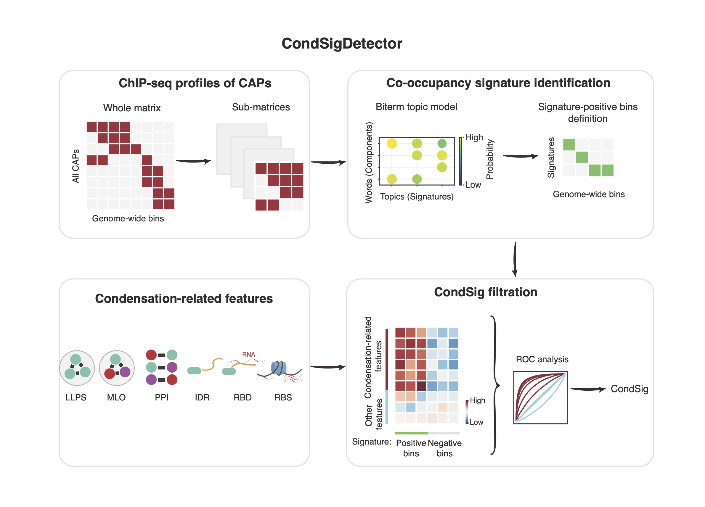

# CondSigDetector

[](https://www.gnu.org/licenses/gpl-3.0)
[](https://www.gnu.org/licenses/gpl-3.0)

**CondSig** (**Cond**ensate-like chromatin-associated proteins co-occupancy **Sig**nature) Detector is a comprehensive computational framework to predict component CAPs (chromatin-associated proteins) and genomic loci of potential chromatin-associated biomolecular condensates. The computation framework first detects genome-wide CAP collaborations in specific loci by integrating ChIP-seq datasets and then screens out some may be involved in biomolecular condensation based on known condensation-related characteristics.

<p align="center">

</p>


## Change Log

### v1.2.0
* Update FilterSig module.

### v1.1.0
* Release CondSigDetector.

## System requirements
* Linux/Unix

## Install CondSigDetector

### Installing the CondSigDetector workflow through conda

CondSigDetector uses the [Anaconda3](http://conda.pydata.org/miniconda.html) package management system to harmonize all of the software packages. Users can install the full solution of CondSigDetector using the conda environment.

Use the following commands to install Minicoda3：
``` bash
$ wget https://repo.anaconda.com/miniconda/Miniconda3-latest-Linux-x86_64.sh
$ bash Miniconda3-latest-Linux-x86_64.sh
```
And then users can create an isolated environment for CondSigDetector and install through the following commands:
``` bash
# Create environment for CondSigDetector
$ conda create -n CondSig_env_v1.2.0 python=3.7
# Activate the environment
$ conda activate CondSig_env_v1.2.0
# Install CondSigDetector
$ conda install -c yuzhaowei -c conda-forge -c bioconda condsig_detector_onlyroc
```

### Test CondSigDetector

```bash
# Test CondSigDetector command
condsig_detector LearnSig --help
condsig_detector FilterSig --help
```

## Usage

### LearnSig module

LearnSig module identifies co-occupancy signatures to represent genome-wide specific collaborations of CAPs by integrating multiple ChIP-seq data in the same cell type. 

User can checkout documentations and tutorials in [LearnSig](docs/LearnSig).

### FilterSig module

FilterSig module screens out condensate-like co-occupancy signatures (CondSigs) from co-occupancy signature by integrating multi-modal condensation-related features. 

User can checkout documentations and tutorials in [FilterSig](docs/FilterSig).

## Citation

-
